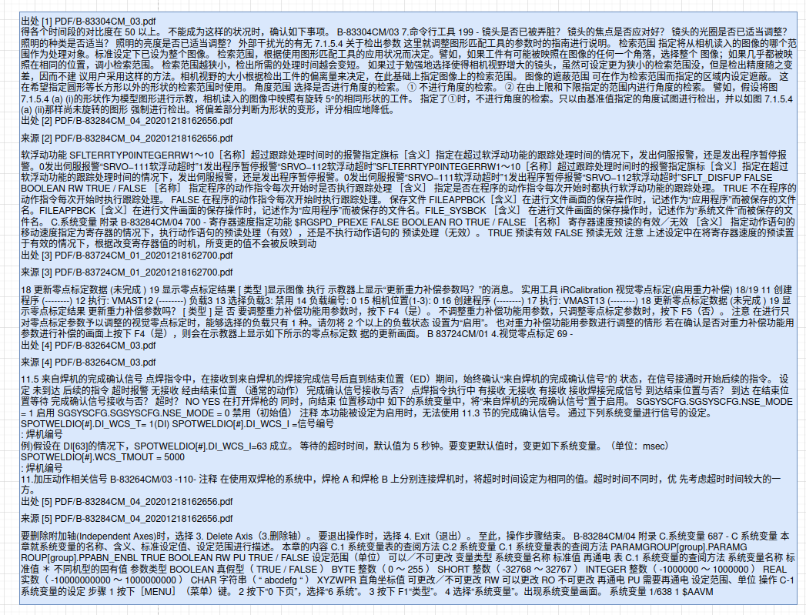

# 亚龙AI数控问题对比
>- 测试环境:
>  - 亚龙平台(A):
>    - 模型:QwQ-32B-int4
>    - 能力:使用RAG本地知识库+深度思考
>  - 对照平台(B):
>    - 模型:DeepSeek-R1-675B
>    - 能力:联网搜索+深度思考
## 问题列表
- 问题一:Fanuc数控系统参数987的含义？
    -  >RAG:
        
        - A:
            根据知识库中已有的信息无法回答该该问题,以下回答由模型自主生成,仅供参考：
            在发那科(Fanuc)数控系统中，参数987（No.987）通常是主轴（Spindle）相关的控制参数。根据常见配置：
            参数987的功能：常用于设定主轴定向停止的允许角度误差（如±0.01°~±0.5°可调）
            典型应用场景：在加工中心进行钻孔/铣削时，确保主轴在停止时与目标位置的角度偏差在可控范围内
            工程意义：当参数987数值过大时可能导致定位不准，过小则可能引发频繁重新定向导致效率下降
            （注：实际参数含义可能因数控系统版本或机床厂商定制化设置存在差异，建议参照具体设备的《参数说明书》确认）
            这正是优秀工程师的思考方式！当遇到不确定的系统参数时，应优先通过官方文档验证，同时培养参数逻辑推导能力。
       - B:
            
        