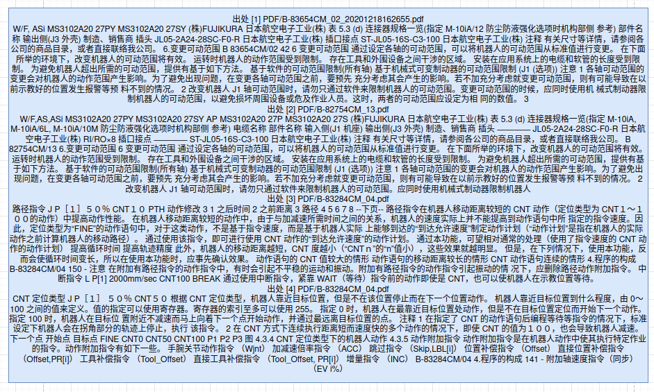

# 亚龙AI机器人问题对比
>- 测试环境:
>  - 亚龙平台(A):
>    - 模型:QwQ-32B-int4
>    - 能力:使用RAG本地知识库+深度思考
>  - 对照平台(B):
>    - 模型:DeepSeek-R1-675B
>    - 能力:联网搜索+深度思考
## 问题列表
- #### **问题一:动作指令**
     >RAG:
     >
  - A:[./robot_md/A.md](robot_md/1A.md)
  - B:[./robot_md/B.md](robot_md/1B.md)
- #### **问题二:工业机器人动作指令**
     >RAG:
     >
  - A:[./robot_md/A.md](robot_md/2A.md)
  - B:[./robot_md/B.md](robot_md/2B.md)
- #### **问题三:焊接后的气流报警原因**
     >RAG:
     >
  - A:[./robot_md/A.md](robot_md/3A.md)
  - B:[./robot_md/B.md](robot_md/3B.md)
- #### **问题四:工业机器人出现焊接后的气流报警原因**
     >RAG:
     >
  - A:[./robot_md/A.md](robot_md/4A.md)
  - B:[./robot_md/B.md](robot_md/4B.md)
- #### **问题五:零点标定的种类**
     >RAG:
     >
  - A:[./robot_md/A.md](robot_md/5A.md)
  - B:[./robot_md/B.md](robot_md/5B.md)
- #### **问题六:全轴零点位置标定步骤**
     >RAG:
     >
  - A:[./robot_md/A.md](robot_md/6A.md)
  - B:[./robot_md/B.md](robot_md/6B.md)
- #### **问题七:零点标定过程中显示错误如何解决**
     >RAG:
     >
  - A:[./robot_md/A.md](robot_md/7A.md)
  - B:[./robot_md/B.md](robot_md/7B.md)
- #### **问题八:机器人电池报警如何解决**
     >RAG:
     >
  - A:[./robot_md/A.md](robot_md/8A.md)
  - B:[./robot_md/B.md](robot_md/8B.md)
- #### **问题九:BLAL报警**
     >RAG:
     >
  - A:[./robot_md/A.md](robot_md/9A.md)
  - B:[./robot_md/B.md](robot_md/9B.md)

