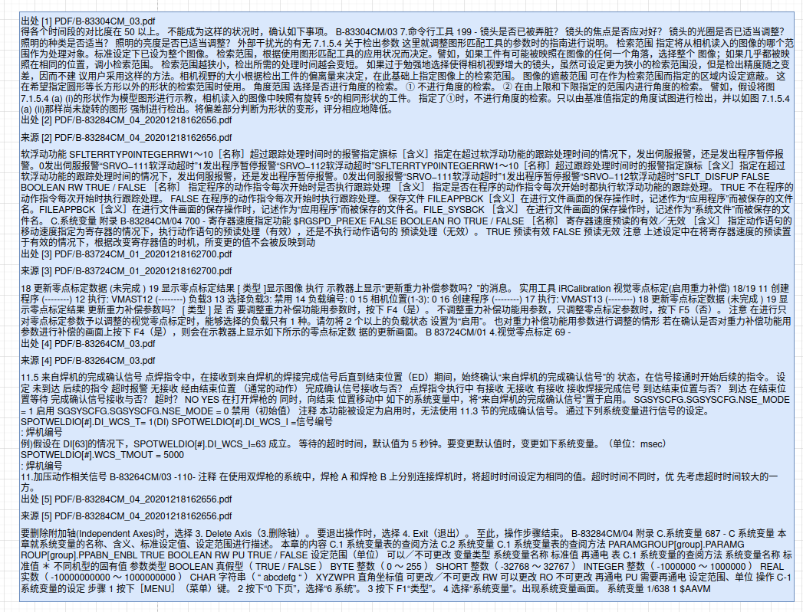
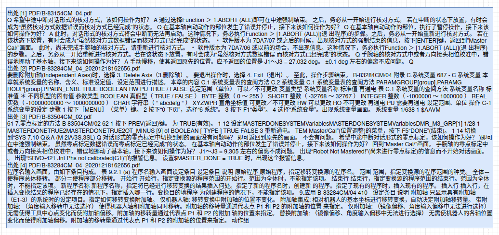
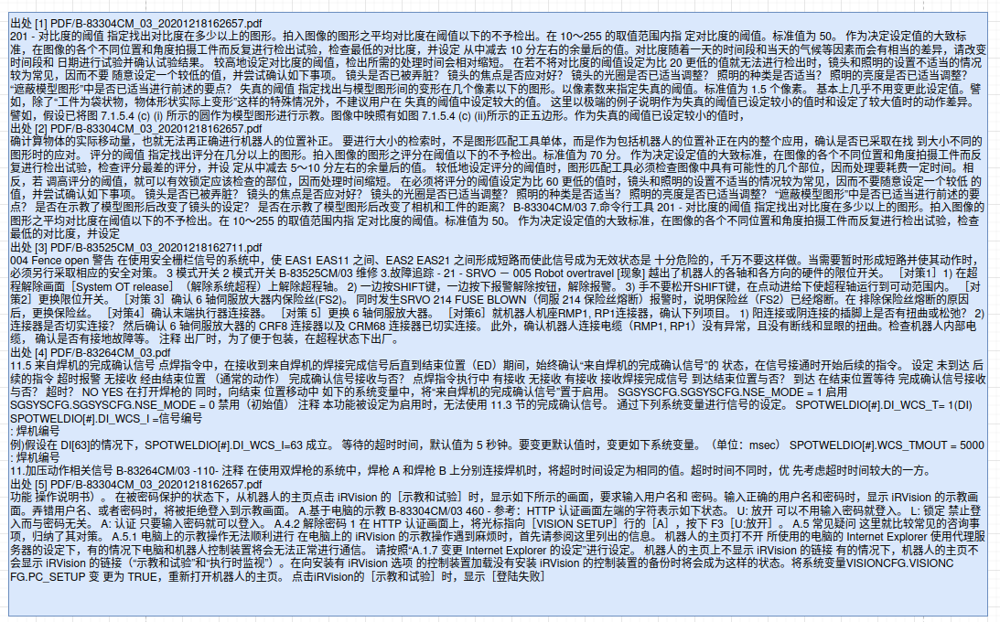
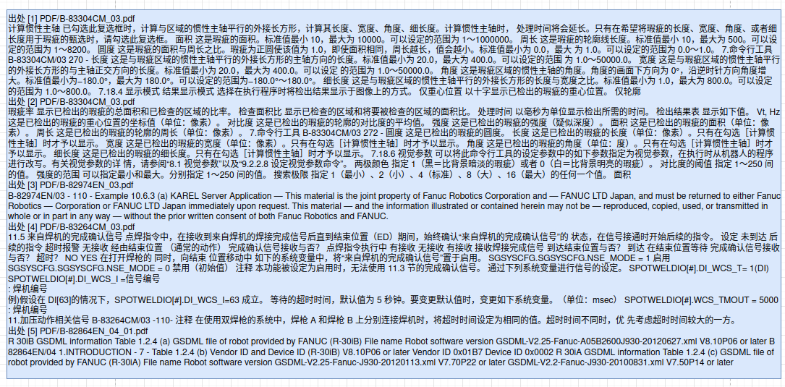
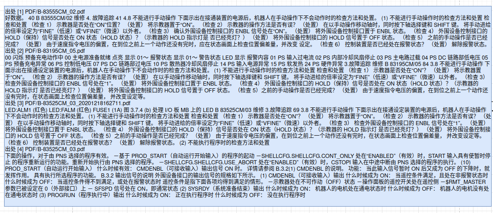
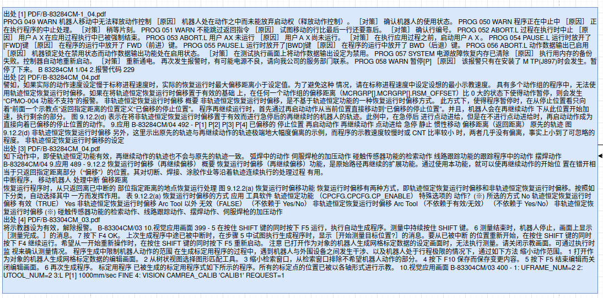
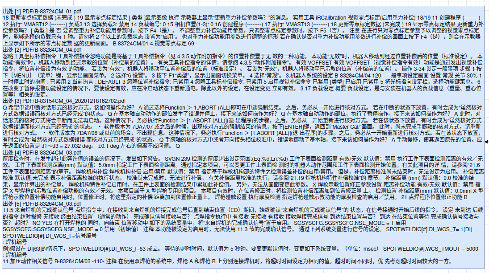
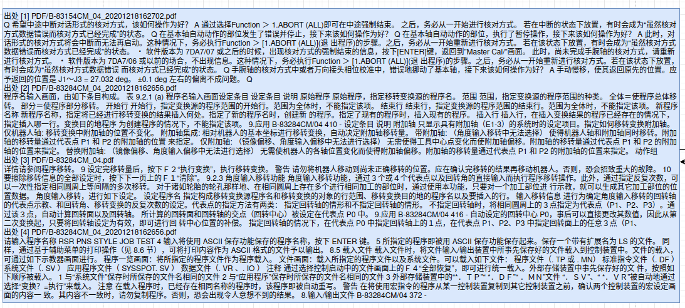
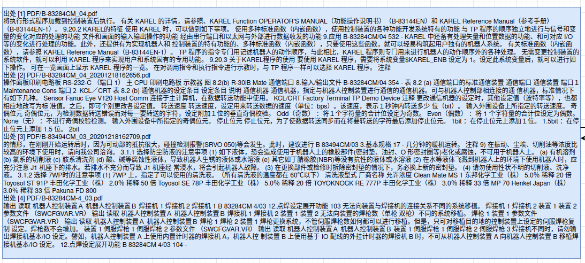
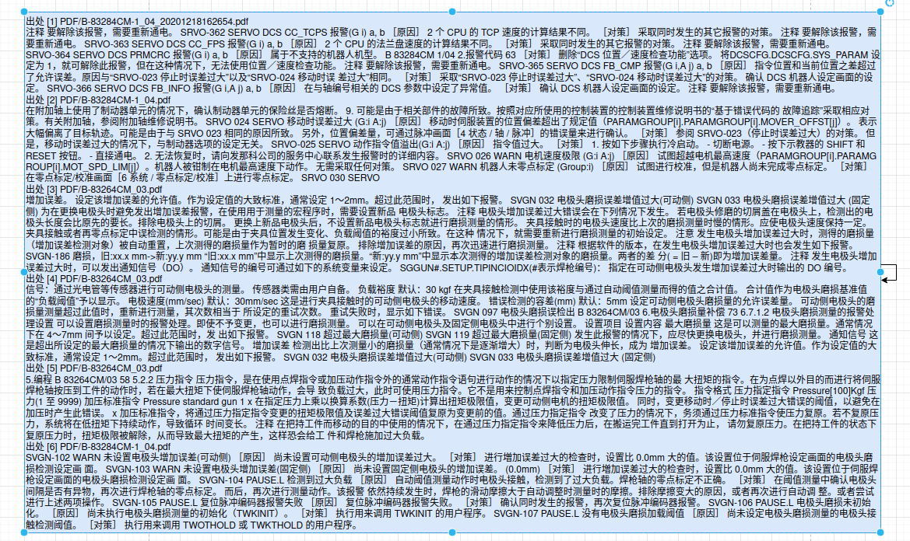

# 亚龙AI数控问题对比
>- 测试环境:
>  - 亚龙平台(A):
>    - 模型:QwQ-32B-int4
>    - 能力:使用RAG本地知识库+深度思考
>  - 对照平台(B):
>    - 模型:DeepSeek-R1-675B
>    - 能力:联网搜索+深度思考
## 问题列表
- #### **问题一:Fanuc数控系统参数987的含义？**
     >RAG:
     >
     >
  - A:[./shuk_md/1A.md](shuk_md/1A.md)
  - B:[./shuk_md/1B.md](shuk_md/1B.md)
- #### **问题二:Fanuc数控系统轴名称如何更改？**
     >RAG:
     >
     >
  - A:[./shuk_md/2A.md](shuk_md/2A.md)
  - B:[./shuk_md/2B.md](shuk_md/2B.md)
- #### **问题三:Fanuc数控系统有哪些常见报警？**
     >RAG:
     >
     >
  - A:[./shuk_md/3A.md](shuk_md/3A.md)
  - B:[./shuk_md/3B.md](shuk_md/3B.md)
- #### **问题四:Fanuc数控系统怎么开通模拟主轴？**
     >RAG:
     >
     >
  - A:[./shuk_md/4A.md](shuk_md/4A.md)
  - B:[./shuk_md/4B.md](shuk_md/4B.md)
- #### **问题五:Fanuc系统的“手动数据输入（MDI）”模式有什么作用？**
     >RAG:
     >
     >
  - A:[./shuk_md/5A.md](shuk_md/5A.md)
  - B:[./shuk_md/5B.md](shuk_md/5B.md)
- #### **问题六:Fanuc系统在自动运行过程中，按下急停后，怎么重新运行？**
     >RAG:
     >
     >
  - A:[./shuk_md/6A.md](shuk_md/6A.md)
  - B:[./shuk_md/6B.md](shuk_md/6B.md)
- #### **问题七:Fanuc数控系统的“刀具半径补偿”功能如何启用？**
     >RAG:
     >
     >
  - A:[./shuk_md/7A.md](shuk_md/7A.md)
  - B:[./shuk_md/7B.md](shuk_md/7B.md)
- #### **问题八:如何在Fanuc系统中输入一个新的数控加工程序？**
     >RAG:
     >
     >
  - A:[./shuk_md/8A.md](shuk_md/8A.md)
  - B:[./shuk_md/8B.md](shuk_md/8B.md)
- #### **问题九:Fanuc数控系统如何与工业机器人（如Fanuc机器人）实现通讯？**
     >RAG:
     >
     >
  - A:[./shuk_md/9A.md](shuk_md/9A.md)
  - B:[./shuk_md/9B.md](shuk_md/9B.md)
- #### **问题十:Fanuc数控系统出现SV0411—移动时误差过大报警怎么解决？**
     >RAG:
     >
     >
  - A:[./shuk_md/10A.md](shuk_md/10A.md)
  - B:[./shuk_md/10B.md](shuk_md/10B.md)

